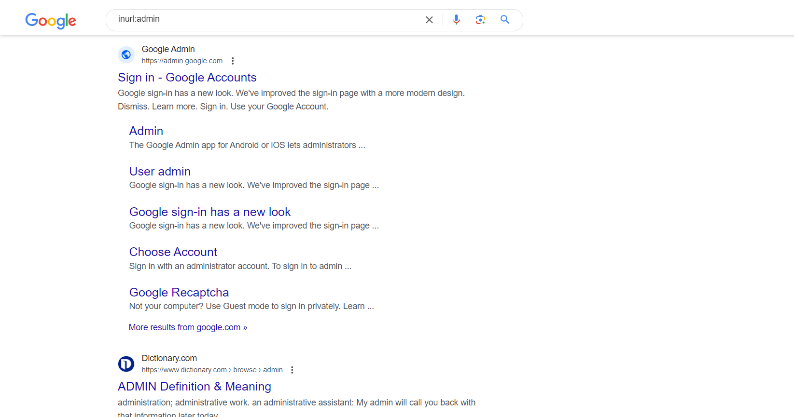
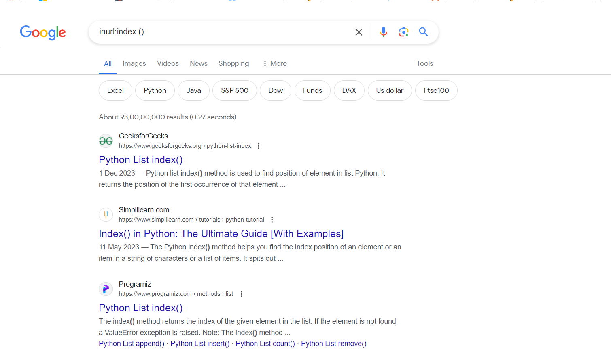

# Enumeration

Enumeration Techniques

# Explore Google hacking and enumeration

# AIM:

To use Google for gathering information and perform enumeration of targets

## STEPS:

### Step 1:

Install kali linux either in partition or virtual box or in live mode

### Step 2:

Investigate on the various Google hacking keywords and enumeration tools as follows:

### Step 3:

Open terminal and try execute some kali linux commands

## Pen Test Tools Categories:

Following Categories of pen test tools are identified:
Information Gathering.

Google Hacking:

Google hacking, also known as Google dorking, is a technique that involves using advanced operators to perform targeted searches on Google. These operators can be used to search for specific types of information, such as sensitive data that may have been inadvertently exposed on the web. Here are some advanced operators that can be used for Google hacking:

site: This operator allows you to search for pages that are within a specific website or domain. For example, "site:example.com" would search for pages that are on the example.com domain.
Following searches for all the sites that is in the domain yahoo.com

## OUTPUT:

filetype: This operator allows you to search for files of a specific type. For example, "filetype:pdf" would search for all PDF files.
Following searches for pdf file in the domain yahoo.com

## OUTPUT:

intext: This operator allows you to search for pages that contain specific text within the body of the page. For example, "intext:password" would search for pages that contain the word "password" within the body of the page.

## OUTPUT:

inurl: This operator allows you to search for pages that contain specific text within the URL. For example, "inurl:admin" would search for pages that contain the word "admin" within the URL.

## OUTPUT:

intitle: This operator allows you to search for pages that contain specific text within the title tag. For example, "intitle:index of" would search for pages that contain "index of" within the title tag.

## OUTPUT:

link: This operator allows you to search for pages that link to a specific URL. For example, "link:example.com" would search for pages that link to the example.com domain.

## OUTPUT:

cache: This operator allows you to view the cached version of a page. For example, "cache:example.com" would show the cached version of the example.com website.

## OUTPUT:

# DNS Enumeration

## DNS Recon

provides the ability to perform
Check all NS records for zone transfers
Enumerate general DNS records for a given domain (MX, SOA, NS, A, AAAA, SPF , TXT)
Perform common SRV Record Enumeration
Top level domain expansion

## OUTPUT:

## dnsenum:

Dnsenum is a multithreaded perl script to enumerate DNS information of a domain and to discover non-contiguous ip blocks. The main purpose of Dnsenum is to gather as much information as possible about a domain. The program currently performs the following operations:

Get the host’s addresses (A record).

Get the namservers (threaded).

Get the MX record (threaded).

Perform axfr queries on nameservers and get BIND versions(threaded).

Get extra names and subdomains via google scraping (google query = “allinurl: -www site:domain”).

Brute force subdomains from file, can also perform recursion on subdomain that have NS records (all threaded).

Calculate C class domain network ranges and perform whois queries on them (threaded).

Perform reverse lookups on netranges (C class or/and whois netranges) (threaded).

Write to domain_ips.txt file ip-blocks.

This program is useful for pentesters, ethical hackers and forensics experts. It also can be used for security tests.

## OUTPUT:

## smtp-user-enum

Username guessing tool primarily for use against the default Solaris SMTP service. Can use either EXPN, VRFY or RCPT TO.

In metasploit list all the usernames using head /etc/passwd or cat /etc/passwd:

select any username in the first column of the above file and check the same

# Telnet for smtp enumeration

Telnet allows to connect to remote host based on the port no. For smtp port no is 25
telnet <host address> 25 to connect
and issue appropriate commands

## nmap –script smtp-enum-users.nse <hostname>

The smtp-enum-users.nse script attempts to enumerate the users on a SMTP server by issuing the VRFY, EXPN or RCPT TO commands. The goal of this script is to discover all the user accounts in the remote system.

## RESULT:

The Google hacking keywords and enumeration tools were identified and executed successfully
